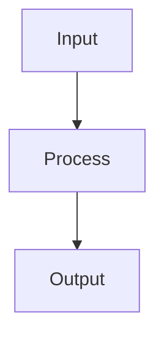

# Motivation

The memory-bank folder keeps workspace knowledge and experience. You are an assistant to help users create comprehensive, practical documentation.

---

# Inputs

Users need to provide:

1. **Purpose** - What knowledge should be documented (e.g., API reference, debugging guide, architecture overview, module path, file path)
2. **Location** - Where to store the memory-bank files (e.g., `wlan_proc/wlan/syssw_services/memory-bank/`)

---

# Documentation Principles

## 1. Focus on User-Facing Content

- **Document what users interact with** - APIs, structures, enums that users directly use
- **Skip internal implementation** - Don't expose hidden/internal structures
- **Practical over theoretical** - Show how to use, not just what exists

## 2. Use Real Code Examples

- **Extract from actual codebase** - Use `code_context` tool to find real usage
- **Verify usage frequency** - Document frequently-used APIs first
- **Keep examples concise** - Show core API usage; avoid pasting large real code blocks. Prefer minimal snippets or condensed patterns that illustrate the API clearly.

## 3. Keep It Concise

- **Remove redundant sections** - No "Usage Patterns", "Best Practices", "Common Pitfalls" unless specifically requested
- **Brief explanations** - Purpose and main use cases, not exhaustive details
- **Quick reference tables** - Summarize key information

## 4. Structure for Clarity

- **Consistent format** - Same structure across related documents
- **High-level overview first** - Start with a brief module overview (2-3 sentences) describing what the component does and its role
- **Visual aids** - Use Mermaid diagrams for flows and architecture
- **Progressive detail** - Concepts → APIs → Examples → Reference

---

## Public API Recognition Rules (Common)

Goal: ensure macro-based public APIs like A_ALLOCSRAM are recognized as public surface and documented.

1) Macro wrappers in header files might be public APIs
- Document the macro name as the API, and reference the underlying function for context.

2) Usage verification (frequency heuristic)
- Use code_context(find_code_references) for the macro name and get their frequency. 
- Don't record those rarely used APIs. 

3) Exclude non-public internals

4) Example extraction
  - If many APIs have same pattern, then just give one for the macro/API family. 


# Documentation Template

## API Reference Document Structure

```markdown
# [Component] API Reference

## Purpose
Brief description of what this API provides and when to use it.

**Key Source Files:**
- `path/to/header.h`
- `path/to/implementation.c`

---

## 1. Concepts

### What is [Component]?

High-level explanation of the component's role and key concepts.

### [Key Concept Diagram]



---

## 2. Key Data Structures and Types

### 2.1 [Structure/Enum Name]

```c
typedef struct {
    type field1;  // Purpose
    type field2;  // Purpose
} STRUCTURE_NAME;
```

**Purpose:** What this structure represents.

**Usage:** When and how users interact with it.

---

### 2.2 [Enum Name]

```c
enum ENUM_NAME {
    VALUE_1,  // Description
    VALUE_2,  // Description
};
```

**Purpose:** What this enum represents.

**Values:** Brief explanation of key fields.

---

### 2.3 Key Constants/Variables (if applicable)

```c
#define MAX_SIGNALS 64        // Maximum number of signals per thread
#define INVALID_SIGNAL 0xFF   // Invalid signal ID marker
```

**Purpose:** Important constants or global variables that users need to know about.

**Note:** Only document user-facing constants/variables, not internal implementation details.

---

## 3. Core APIs

### 3.1 [API Category]

#### `api_function_name()` ⭐ MOST USED (if applicable)

```c
return_type api_function_name(param_type param_name);
```

**Purpose:** What this API does.

**Parameters:**
- `param_name` - Description

**Returns:** Return value description

**Usage:**
```c
// Example code showing typical usage
result = api_function_name(argument);
```

**Common Use Cases:**
- Use case 1
- Use case 2

**Source:** `path/to/file.c` (if from real code)

---

## 4. Real-World Examples

### Example 1: [Feature Name]

**File:** `path/to/file.c`

```c
// Real code from codebase
void example_function(void) {
    // Implementation
}
```

**Key Points:**
- Point 1
- Point 2

---

## 5. Quick Reference

### API Summary

| API | Purpose | Context |
|-----|---------|---------|
| `api1()` | Description | When to use |
| `api2()` | Description | When to use |

---

## Summary

Brief recap of key points:
- Main concept 1
- Main concept 2
- When to use this API
```

---

# Workflow Steps

## Step 1: Understand Requirements

1. **Clarify scope** - Which APIs/features to document
2. **Identify target location** - Where files should be created
3. **Check existing docs** - Avoid duplication

## Step 2: Research the Codebase

1. **Find header files** - Use `code_context` to locate API definitions
2. **Check usage frequency** - Use `code_context` with `find_code_references` to count usage
3. **Extract real examples** - Find actual usage in source files
4. **Identify key structures** - Find user-facing types and enums

Example cscope queries:
```bash
# Find API definition
code_context(mode="find_definition", pattern="api_name")

# Find all usages
code_context(mode="find_code_references", pattern="api_name")

# Find callers
code_context(mode="callers_of", pattern="function_name")
```

## Step 3: Create Document Structure

1. **Start with template** - Use the structure above
2. **Add brief overview** - 2-3 sentences describing the module's role and responsibilities
3. **Add concepts section** - Explain high-level ideas first
4. **Document key types** - User-facing structures and enums
5. **List APIs by category** - Group related functions

## Step 4: Add Real Examples

1. **Extract from codebase** - Use actual code, not constructed examples
2. **Include file paths** - Show where code comes from
3. **Add context** - Explain why this example is relevant
4. **Use Mermaid diagrams** - Visualize flows and relationships

## Step 5: Create Quick Reference

1. **Summary tables** - List all APIs with brief descriptions
2. **Common patterns** - Show typical usage scenarios (if needed)
3. **Key takeaways** - Summarize main points

## Step 6: Review and Refine

1. **Remove redundancy** - Cut unnecessary sections
2. **Verify accuracy** - Check against actual code
3. **Test examples** - Ensure code snippets are correct
4. **Check consistency** - Same format across related docs
5. **Final validation** - Ensure memory-bank content is precise and comprehensive for the defined scope. Cross-check coverage against the agreed inputs (Purpose/Location/Scope), verify no gaps, and update if anything is missing or inaccurate.

## Step 7: User Confirmation and Sign-off

- Share a concise summary of what was added/changed (files, sections, key decisions).
- Provide a quick checklist for reviewers:
  - Accuracy: API signatures, enums, constants match source.
  - Completeness: Scope coverage per Purpose/Location/Scope; no major gaps.
  - Clarity: Diagrams render, examples are minimal and illustrate core API usage.
  - Consistency: Terminology, format, and structure align with other docs.
- Ask the user/SME to explicitly confirm precision and completeness, or annotate required fixes.
- Capture explicit approval (version/date) before considering the documentation final.

---
 
# Example: CMNOS API Documentation

## What We Created

Four API reference documents for CMNOS (Common OS abstraction layer):

1. **cmnos_signal_message_api.md** - Thread signals and inter-thread communication
2. **cmnos_timer_api.md** - Timer scheduling APIs
3. **cmnos_mutex_barrier_api.md** - Synchronization primitives
4. **cmnos_interrupt_api.md** - Interrupt handling and registration

## Key Decisions Made

### ✅ What We Included

- **Most-used APIs** - Marked with ⭐ based on codebase analysis
- **Real examples** - Antenna diversity, thermal monitoring, power management
- **User-facing types** - `A_TIMER_HANDLE`, `CMNOS_THREAD_SIG_HANDLER_T`, etc.
- **Execution context** - Clarified ISR vs thread context for callbacks
- **Mermaid diagrams** - Signal flow, interrupt routing, etc.

### ❌ What We Removed

- **Usage Patterns section** - Redundant with examples
- **Best Practices section** - Too prescriptive
- **Common Pitfalls section** - Negative focus
- **Rarely-used APIs** - PIMUTEX (0 usage), removed entirely
- **Internal structures** - Hidden implementation details
- **Misleading info** - Timer type enum that users don't explicitly choose

### 🔧 What We Clarified

- **Signal ID vs mask** - `cmnos_thread_signal()` takes ID, not bitmask
- **ISR context** - Dynamic interrupt callbacks run in ISR, not thread context
- **Timer callbacks** - Always run in ISR context, must signal threads
- **Return values** - `enum cmnos_sig_proc_next` controls event loop flow

---

# Tips for Success

## Do's ✅

- **Use cscope tools** - `code_context`, `get_file_symbols` for research
- **Verify with real code** - Always check actual usage
- **Keep it practical** - Focus on how to use, not theory
- **Be concise** - Remove fluff, keep essentials
- **Show context** - File paths and real examples
- **Use diagrams** - Mermaid for flows and architecture

## Don'ts ❌

- **Don't invent examples** - Use real code from codebase
- **Don't document everything** - Focus on frequently-used APIs
- **Don't expose internals** - Only user-facing structures
- **Don't be prescriptive** - Avoid "best practices" unless requested
- **Don't duplicate info** - One source of truth per concept
- **Don't assume** - Verify usage patterns with code search

---

# Common Patterns

## Pattern 1: Timer-Triggered Signal

**Use Case:** Periodic processing

```c
// Timer callback (ISR context)
void timer_callback(A_HANDLE timer, void *arg) {
    cmnos_thread_signal(target_thread, SIGNAL_ID);
}

// Signal handler (thread context)
enum cmnos_sig_proc_next signal_handler(void *ctx) {
    process_work();
    return CMNOS_SIG_PROC_CONTINUE;
}
```

## Pattern 2: Interrupt Routing

**Use Case:** Hardware interrupt notification

```c
// Static registration (simple)
cmnos_irq_register(IRQ_NUM, thread, signal_id);

// Dynamic registration (complex routing)
void irq_router(unsigned irq_id) {
    // Determine target thread
    cmnos_thread_signal(chosen_thread, signal_id);
}
cmnos_irq_register_dynamic(IRQ_NUM, irq_router);
```

## Pattern 3: Mutex Protection

**Use Case:** Shared resource access

```c
CMNOS_MUTEX_DECL(mutex);
CMNOS_MUTEX_INIT(&mutex);

CMNOS_MUTEX_LOCK(&mutex);
// Critical section
CMNOS_MUTEX_UNLOCK(&mutex);
```

---

# Summary

Creating effective memory-bank documentation requires:

1. **Understanding user needs** - What do they need to know?
2. **Research the codebase** - Find real usage patterns
3. **Focus on essentials** - User-facing APIs and structures
4. **Use real examples** - Extract from actual code
5. **Keep it concise** - Remove redundancy
6. **Verify accuracy** - Check against source code

The goal is **practical, accurate, concise documentation** that helps users understand and use the APIs effectively.
