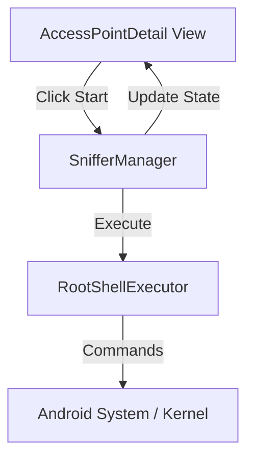

# Design Document

## Overview

The WiFi Sniffer feature transforms the WiFiAnalyzer app into a packet capture tool for rooted Qualcomm wcn7750 devices. It introduces a `SnifferManager` to handle privileged shell commands for driver manipulation and `tcpdump` execution. The UI integration allows users to initiate capture directly from the Access Point list.

## Steering Document Alignment

### Technical Standards
-   **Root Access Pattern**: Uses a dedicated `RootShellExecutor` to encapsulate `su` calls, keeping the rest of the app clean.
-   **State Management**: Uses a Singleton `SnifferManager` to track the device state (Scanning vs. Sniffing).

### Project Structure
-   New package `com.vrem.wifianalyzer.wifi.sniffer` will contain all sniffer-related logic.
-   Modifications to `com.vrem.wifianalyzer.wifi.accesspoint` will be minimal, restricted to UI hooks.

## Code Reuse Analysis

### Existing Components to Leverage
-   **`WiFiDetail`**: Used to extract channel and bandwidth information for the target AP.
-   **`MainContext`**: Used to access global services/singletons.

### Integration Points
-   **`AccessPointsAdapter` / `AccessPointDetail`**: The entry point for the user to start sniffing.
-   **`ScannerService`**: Needs to be paused/stopped when Sniffer Mode is active, as the wifi interface will be taken down.

## Architecture

### Modular Design Principles
-   **`RootShellExecutor`**: Handles low-level shell execution.
-   **`SnifferManager`**: Business logic for the specific wcn7750 command sequence.
-   **`SnifferState`**: Sealed class representing the current state (Idle, Preparing, Capturing, Error).



## Components and Interfaces

### `RootShellExecutor`
-   **Purpose:** Execute shell commands with root privileges.
-   **Interfaces:**
    -   `execute(command: String): Boolean`
    -   `executeSequence(commands: List<String>): Boolean`

### `SnifferManager`
-   **Purpose:** Coordinate the sniffer workflow.
-   **Interfaces:**
    -   `startCapture(channel: Int, bandwidth: Int): Boolean`
    -   `stopCapture(): Boolean`
    -   `isCapturing(): Boolean`
-   **Dependencies:** `RootShellExecutor`
-   **WiFi State Handling:**
    -   **Pre-Capture:** Executes `svc wifi disable` to forcibly stop the Android WiFi service, ensuring exclusive access to the `wlan0` interface. This disconnects any active AP connections.
    -   **Post-Capture (Optional):** May execute `svc wifi enable` to restore normal functionality (if implemented as a restore feature).

### `AccessPointDetail` (Modification)
-   **Purpose:** Display AP details and now the "Start Sniffer" button.
-   **Modifications:**
    -   Add "Start/Stop Capture" button to the view.
    -   Bind button click to `SnifferManager`.
    -   **User Warning:** When "Start Capture" is clicked, show a confirmation dialog: "Starting capture will disable standard WiFi functionality and disconnect any active connections. Continue?"

## Data Models

### `SnifferConfig`
```kotlin
data class SnifferConfig(
    val channel: Int,
    val bandwidth: Int,
    val outputFileName: String
)
```

## Error Handling

### Error Scenarios
1.  **Root Permission Denied**:
    -   **Handling**: Catch exception, set state to Error.
    -   **User Impact**: Show Toast/Snackbar "Root permission required".
2.  **Driver Reload Fail**:
    -   **Handling**: Abort sequence, attempt to restore Wifi service.
    -   **User Impact**: Show "Failed to enable monitor mode".

## Testing Strategy

### Unit Testing
-   Test `SnifferManager` state transitions (mocking `RootShellExecutor`).
-   Test command string generation.

### Manual Testing
-   Verify on wcn7750 device.
-   Check `tcpdump` process running via adb.
-   Verify `.pcap` file creation in `/data/local/temp/`.
