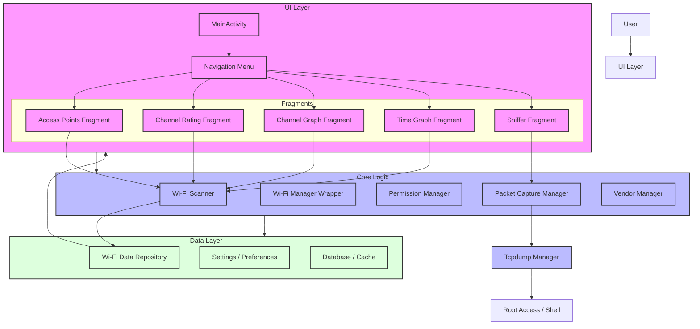

# Project Description: WiFiAnalyzer

WiFiAnalyzer is an Android application designed to analyze Wi-Fi networks, providing tools for signal strength monitoring, channel rating, and network troubleshooting.

## Key Features

1.  **Wi-Fi Scanning**: Real-time scanning of nearby Wi-Fi networks (2.4GHz, 5GHz, 6GHz).
2.  **Visualizations**:
    *   **Channel Graph**: Visualizes AP distribution across channels.
    *   **Time Graph**: Tracks signal strength over time.
3.  **Channel Rating**: Rates channels based on interference and congestion to recommend the best channel.
4.  **Detailed Information**: Displays SSID, BSSID, signal strength (dBm), security capabilities, and estimated distance.
5.  **Packet Capture (Sniffer)**: Captures Wi-Fi packets on rooted devices using tcpdump for analysis.
6.  **Vendor Lookup**: Identifies device manufacturers via OUI.

## Architecture Logic Diagram



## Sniffer Feature Workflow

The Sniffer feature is a specialized component for packet capture.

```mermaid
sequenceDiagram
    participant User
    participant UI as SnifferFragment
    participant VM as SnifferViewModel
    participant Svc as SnifferService
    participant PCM as PacketCaptureManager
    participant TD as TcpdumpManager
    participant Shell as Root Shell

    User->>UI: Click Start Capture
    UI->>VM: startCapture()
    VM->>Svc: Start Service Intent
    Svc->>PCM: startCapture(config)
    PCM->>TD: startTcpdump(interface, file)
    TD->>Shell: Execute tcpdump command
    Shell-->>TD: Process Started
    TD-->>PCM: Success
    PCM-->>Svc: Update State (RUNNING)
    Svc-->>VM: Broadcast State
    VM-->>UI: Update UI (Show Stop Button)
    
    User->>UI: Click Stop Capture
    UI->>VM: stopCapture()
    VM->>Svc: Stop Service Action
    Svc->>PCM: stopCapture()
    PCM->>TD: stopTcpdump()
    TD->>Shell: Kill tcpdump process
    Shell-->>TD: Process Ended
    TD-->>PCM: Success
    PCM-->>Svc: Update State (STOPPED)
    Svc-->>VM: Broadcast State
    VM-->>UI: Update UI (Show Start Button)
