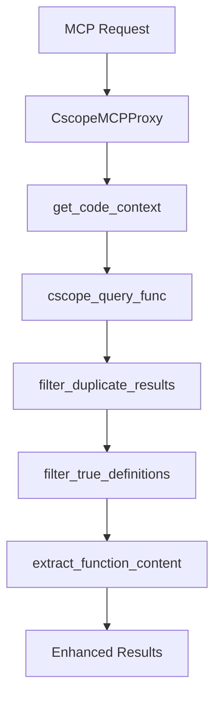
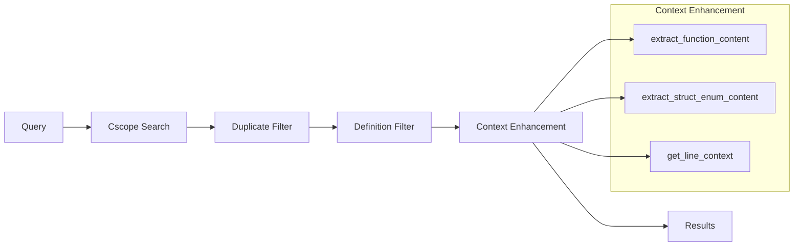

# Cscope/Ctags get_code_context Flow Summary

## Overview

The `get_code_context` function is the core API for code context extraction in QGenie Context system. It processes different types of code queries (find symbols, text search, find references) and returns enhanced results with complete function/struct content.

## High-Level Architecture

## Core API Functions

### 1. get_code_context()
**Purpose**: Main entry point for code context extraction

**Flow**:
1. Check if pattern is a source file → return complete file content
2. Execute cscope query (with smart lookup if available)
3. Filter duplicate results
4. Filter true definitions (for mode=1)
5. Enhance first 3 results with complete context
6. Return formatted response

### 2. extract_function_content()
**Purpose**: Extract complete function or struct content from source files

**Logic**:
- Detects content type (function, struct, enum, typedef)
- Uses brace counting to find complete boundaries
- Handles special cases like typedef end patterns
- Returns complete code block or falls back to line context

### 3. extract_struct_enum_content()
**Purpose**: Extract complete struct/enum definitions

**Process**:
- Searches backward for struct/enum start
- Uses brace matching to find complete definition
- Handles typedef patterns and modifiers

### 4. CtagsContextExtractor.extract_function_context()
**Purpose**: Use ctags for precise function boundary detection

**Method**:
- Loads line-sorted tags for the file
- Binary search to find containing function
- Extracts complete function using ctags boundaries

## Query Modes

| Mode | Function | Purpose |
|------|----------|---------|
| 0 | find_code_references | Find all references to a symbol |
| 1 | find_definition | Find symbol definitions |
| 2 | callees_of | Find functions called by this function |
| 3 | callers_of | Find functions calling this function |
| 4 | text_search | Text-based search |
| 6 | include_lines | Find include files |
| 7 | file_path | File path search |

## Processing Pipeline

## Key Features

### Smart Filtering
- **Duplicate Detection**: Removes redundant results from multiple compilation units
- **True Definition Filter**: Distinguishes actual definitions from usage/declarations
- **Priority Ranking**: Definitions > Declarations > Usage

### Context Enhancement
- **First 3 Results**: Complete function/struct content
- **Remaining Results**: Basic info only (performance optimization)
- **Fallback Strategy**: Line context if function extraction fails

### Content Type Detection
- **Functions**: Complete function body with signature
- **Structs/Enums**: Complete type definitions including typedef
- **Macros**: Multi-line macro definitions
- **Source Files**: Complete file content for file patterns

## Integration Points

### Ctags Integration
- **CtagsContextExtractor**: Provides precise function boundaries
- **Line-sorted caching**: Optimized tag lookup by line number
- **Binary search**: Fast function boundary detection

### Cscope Integration
- **Primary search engine**: Text-based code search
- **Multiple query modes**: Different search types
- **Smart lookup**: Enhanced search with ROM/RAM awareness

## Performance Optimizations

1. **Selective Enhancement**: Only first 3 results get full context
2. **File Pattern Detection**: Direct file content for source files
3. **Caching**: Reuses ctags data and file content
4. **Early Termination**: Limits on file size and function length

## Error Handling

- **Graceful Degradation**: Falls back to simpler context if extraction fails
- **File Access Errors**: Skips enhancement, keeps basic results
- **Encoding Issues**: Uses error-tolerant file reading
- **Timeout Protection**: Prevents hanging on problematic files

## Summary

The `get_code_context` system provides intelligent code analysis by:

1. **Routing queries** through cscope for fast text search
2. **Filtering results** to remove duplicates and irrelevant matches
3. **Enhancing context** with complete function/struct definitions
4. **Optimizing performance** through selective processing and caching

This creates a responsive code exploration experience that balances completeness with performance, suitable for large codebases while providing rich context for development tools.
