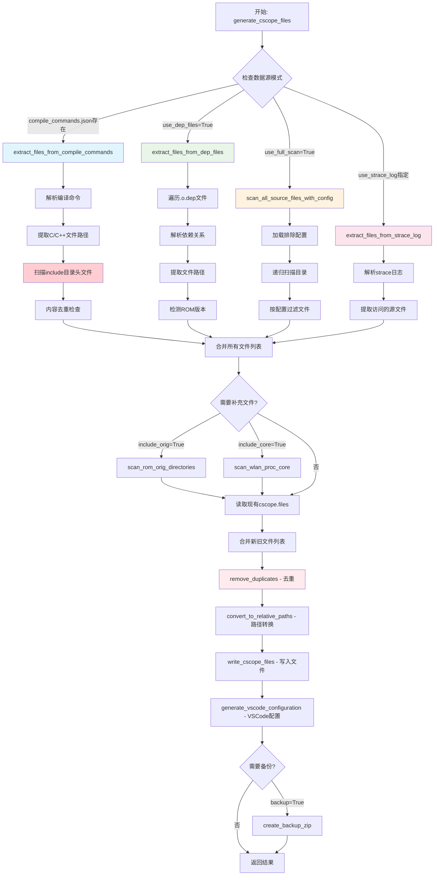

# cscope.files 生成流程分析报告

## [title]: cscope.files 生成系统

## [description]: 
`generate_cscope_files`是QGenie Context系统中的核心函数，负责从多种数据源（compile_commands.json、.o.dep文件、全目录扫描、strace日志）收集C/C++源代码文件路径，生成cscope.files文件用于代码索引和导航。

## [scenario]: 
该函数在QGenie Context的代码索引构建流程中扮演关键角色：
- **构建自动化**：通过`build_automation.py`的`update_cscope_database`方法调用
- **命令行工具**：通过`execute_main_logic`函数提供独立的命令行接口
- **API接口**：提供`generate_cscope_files_simple`和`generate_cscope_files_with_backup`等简化API
- **集成VSCode**：自动生成VSCode配置文件，实现IDE集成

## [debug]: 
主要调试变量和日志：
- `verbose`参数：控制详细日志输出
- `log_info()`：记录各阶段处理信息
- `log_warning()`：记录警告信息（如文件缺失）
- `log_error()`：记录错误信息
- 关键调试点：
  - 文件数量统计：`len(files)`
  - 排除文件计数：`excluded_count`
  - ROM版本检测：`rom_version`
  - 构建版本检测：`build_version`

## [callship]: 调用关系层次结构

```c
generate_cscope_files()  // 主函数入口
├── 数据源收集阶段:
│   ├── extract_files_from_compile_commands()  // compile_commands.json处理
│   │   ├── extract_include_directories_from_compile_commands()
│   │   ├── scan_header_files_in_directories()  ★ (已修复软链接问题)
│   │   └── remove_duplicate_headers_with_content_check()
│   │
│   ├── extract_files_from_dep_files()  // .o.dep文件处理
│   │   └── detect_rom_version_from_files()
│   │
│   ├── scan_all_source_files_with_config()  // 全目录扫描
│   │   └── load_exclude_config()
│   │
│   └── extract_files_from_strace_log()  // strace日志处理
│
├── 补充文件扫描:
│   ├── scan_rom_orig_directories()  // ROM原始文件
│   ├── scan_wlan_proc_core()  // 核心模块文件
│   └── detect_build_version_from_command()
│
├── 文件处理阶段:
│   ├── read_cscope_files()  // 读取现有文件
│   ├── remove_duplicates()  ★ (简单字符串去重)
│   └── convert_to_relative_paths()  // 路径转换
│
├── 输出生成阶段:
│   ├── write_cscope_files()  // 写入cscope.files
│   ├── generate_vscode_configuration()  // VSCode配置
│   └── create_backup_zip()  // 备份创建
│
└── 调用者:
    ├── BuildAutomation.update_cscope_database()
    ├── PWBuildVariantManager.create_cscope_database()
    ├── execute_main_logic()  // CLI入口
    ├── generate_cscope_files_simple()  // 简化API
    └── generate_cscope_files_with_backup()  // 带备份API
```

## [graph]: 流程关系图



## [report]: 详细分析报告

### 1. 系统架构概述

`generate_cscope_files`函数采用**多数据源联合**的设计模式，支持4种主要的文件收集方式：

1. **compile_commands.json模式**：解析编译数据库，提取编译过程中的源文件
2. **.o.dep文件模式**：分析依赖文件，获取头文件依赖关系
3. **全目录扫描模式**：基于配置文件的智能目录遍历
4. **strace日志模式**：从系统调用跟踪中提取访问的源文件

### 2. 核心处理流程

#### 2.1 数据源收集阶段
- **优先级策略**：compile_commands.json > .o.dep > 全扫描 > strace
- **联合模式**：默认情况下会同时使用compile_commands.json和.o.dep文件
- **排除机制**：自动排除wiredconnectivity目录和/afs系统头文件

#### 2.2 文件处理阶段
- **路径标准化**：将相对路径转换为绝对路径，再转回相对路径
- **去重处理**：使用`remove_duplicates`进行简单字符串去重
- **软链接处理**：已修复`scan_header_files_in_directories`中的软链接解析问题

#### 2.3 补充扫描阶段
- **ROM文件扫描**：基于检测到的ROM版本扫描对应的orig目录
- **核心模块扫描**：扫描wlan_proc/core目录，根据构建版本排除不需要的ROM目录

### 3. 关键技术特性

#### 3.1 智能版本检测
- **ROM版本检测**：通过路径模式`/rom/{version}/patch/`自动识别
- **构建版本检测**：从`latest_command.txt`中提取v1/v2版本信息

#### 3.2 头文件处理
- **include目录扫描**：从编译命令中提取-I参数，扫描对应目录
- **内容去重**：对同名头文件进行内容比较，保留唯一版本
- **优先级排序**：ROM patch文件 > 普通文件 > ROM orig文件

#### 3.3 集成能力
- **VSCode集成**：自动生成.vscode配置文件
- **备份功能**：可选择创建包含所有源文件的zip备份
- **批处理脚本**：支持生成Windows批处理脚本

### 4. 性能优化

#### 4.1 扫描限制
- **超时控制**：ROM orig扫描限制30秒
- **文件数量限制**：ROM orig文件限制2000个
- **并发处理**：支持多线程ctags处理（配置中的ctags_workers: 16）

#### 4.2 缓存机制
- **增量更新**：读取现有cscope.files并合并新文件
- **路径缓存**：避免重复的路径解析操作

### 5. 错误处理与调试

#### 5.1 容错设计
- **文件缺失容错**：compile_commands.json缺失时自动降级到.o.dep模式
- **权限错误处理**：文件访问失败时记录警告但继续处理
- **格式兼容性**：支持标准和非标准的compile_commands.json格式

#### 5.2 调试支持
- **详细日志**：verbose模式提供完整的处理过程日志
- **统计信息**：提供文件数量、排除数量、处理时间等统计
- **错误追踪**：完整的异常捕获和错误信息记录

### 6. 最近修复的问题

#### 6.1 软链接处理修复
**问题**：`scan_header_files_in_directories`函数会自动解析软链接到真实路径，导致同一文件通过软链接和真实路径被重复添加。

**修复**：移除了软链接自动解析逻辑，保持原始路径结构，避免路径混合导致的重复问题。

**影响**：防止了真实代码文件被错误删除的风险，确保了文件路径的一致性。

### 7. 系统集成点

- **构建系统**：通过BuildAutomation类集成到自动化构建流程
- **命令行工具**：提供独立的CLI接口支持手动执行
- **VSCode插件**：自动生成IDE配置实现无缝集成
- **MCP服务**：作为代码索引服务的基础组件

该系统为QGenie Context提供了强大而灵活的代码文件收集能力，支持多种使用场景和数据源，是整个代码分析和导航系统的基础。
